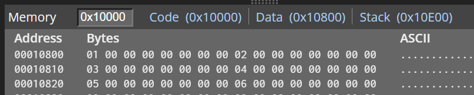
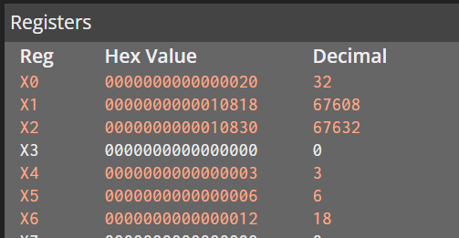

## Test Week 2

### 3.4 练习题：计算两个向量的内积

以下代码首先手工把数组[1,2,3]和[4,5,6]从0x10800地址开始存储，然后再启动循环计算两个数组的内积，最后把内积数字存储在x0中。



请补全循环计算的代码，第16行x3为循环变量，从第18行开始，x1, x2作为指向两个数组的指针。

```
    adr x1, #0x800
    mov x0, #1
    str x0, [x1], #8
    mov x0, #2
    str x0, [x1], #8 
    mov x0, #3
    str x0, [x1], #8
    mov x0, #4
    str x0, [x1], #8 
    mov x0, #5
    str x0, [x1], #8
    mov x0, #6
    str x0, [x1], #8

    mov x0, #0
    mov x3, #3

    subs x2, x1, #24
    subs x1, x1, #48
mult_loop:
    //...
    ldr x4, [x1], #8
    ldr x5, [x2], #8
    mul x6, x4, x5
    add x0, x0, x6
    subs x3, x3, #1
    b.ne mult_loop

```

程序运行结束后，x0的值为十进制32


