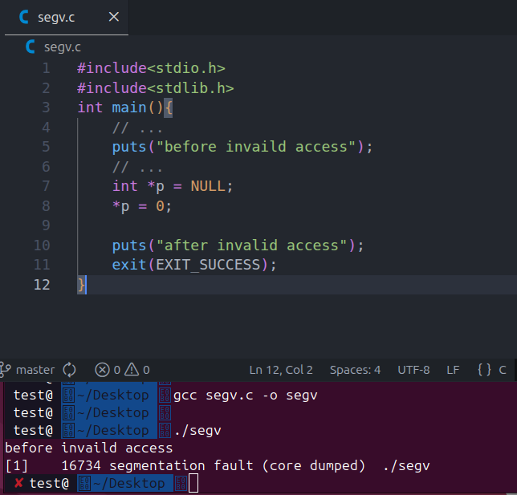
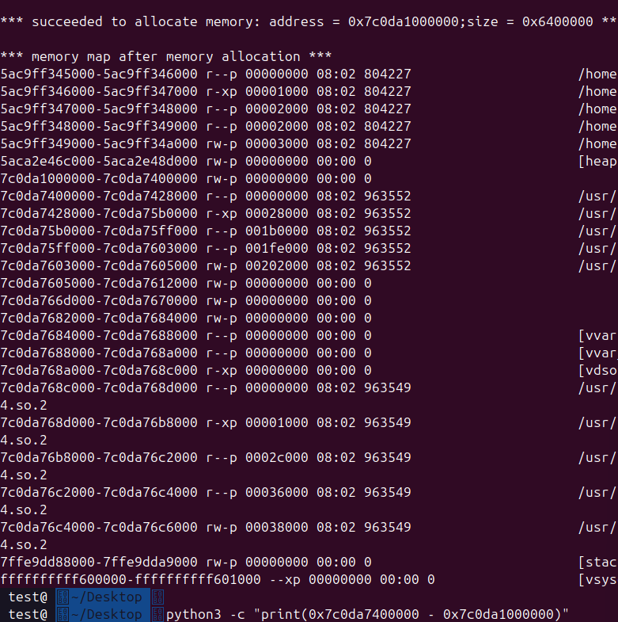
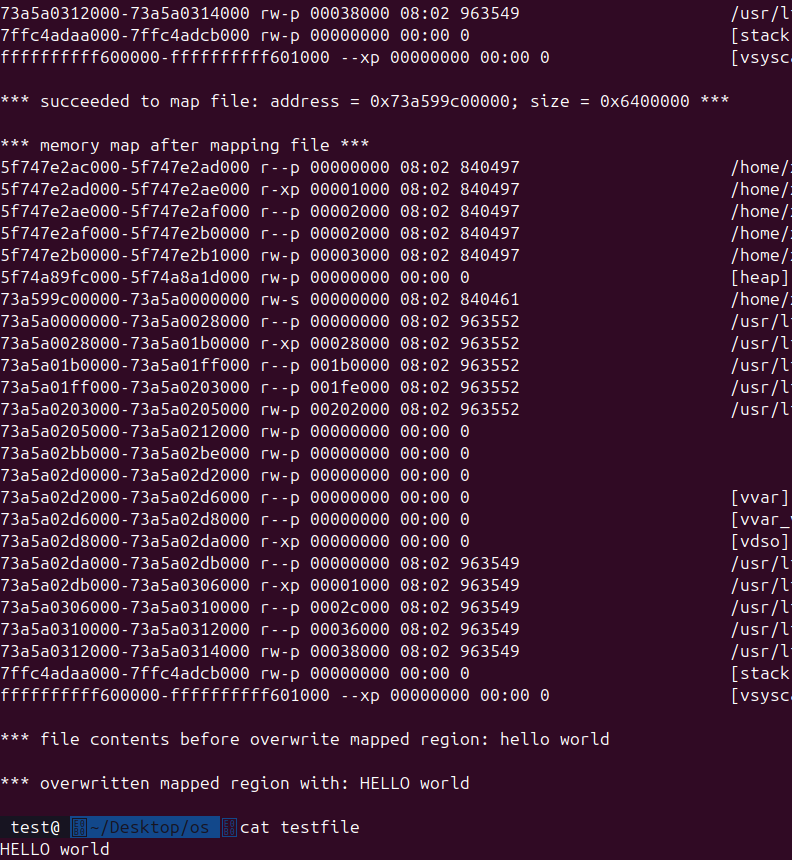

## Test Week 3-4

### 2.1 实验内容：访问非法地址

```
#include <stdio.h>
#include <stdlib.h>
int main(void)
{
    // ...
    puts("before invalid access");
    // ...
    int *p = NULL;
    *p = 0;

    puts("after invalid access");
    exit(EXIT_SUCCESS);
}
```

- 输出字符串before invalid access。
- 声明一个指针，指向必定会访问失败的一个地址。然后向这个地址写入一个值（比如可以写入0）。
- 输出字符串after invalid access。

### 运行

运行这个程序

```
gcc -o segv segv.c
./segv
```

观察到输出了“Segmentation fault...”



### 4.4 实验内容：探究内存分配的运作方式
程序mmap.c，实现以下要求

```
#include <unistd.h>
#include <sys/mman.h>
#include <stdio.h>
#include <stdlib.h>
#include <err.h>
#define BUFFER_SIZE 1000
#define ALLOC_SIZE (100 * 1024 * 1024)
static char command[BUFFER_SIZE];
int main(void)
{
    pid_t pid;
    pid = getpid();
    snprintf(command, BUFFER_SIZE, "cat /proc/%d/maps", pid);
    puts("*** memory map before memory allocation ***");
    fflush(stdout);
    system(command);
    void *new_memory;
    // 此处需要调用 mmap，完成 ALLOC_SIZE 大小的内存空间分配。可以在网上查询mmap的常规用法
    new_memory = mmap(NULL, ALLOC_SIZE, PROT_READ | PROT_WRITE, MAP_PRIVATE | MAP_ANONYMOUS, -1, 0);

    if (new_memory == (void *)-1)
        err(EXIT_FAILURE, "mmap() failed");
    puts("");
    printf("*** succeeded to allocate memory: address = %p;size = 0x%x ***\n", new_memory, ALLOC_SIZE);
    puts("");
    puts("*** memory map after memory allocation ***");
    fflush(stdout);
    system(command);
    if (munmap(new_memory, ALLOC_SIZE) == -1)
        err(EXIT_FAILURE, "munmap() failed");
    exit(EXIT_SUCCESS);
}
```

- 显示应用程序的内存映射信息（/proc/<pid>/maps的输出)
- 额外获取100MB的内存。
- 再次显示内存映射信息运行这个程序
- 运行这个程序

```
gcc -o mmap mmap.c
./mmap
```

确定该内存区域的大小

```
python3 -c "print(0x7c0da7400000 - 0x7c0da1000000)"
```

`104857600`

- 上面的地址需要替换为你观察到的起始地址和终止地址
- 可以看到程序准确无误地分配了100MB的内存




### 6.2 实验内容：文件映射
- 首先，创建一个名为testfile的文件，并向其写入任意字符串，保证长度大于“HELLO”
```
touch testfile
```

```
#include <sys/types.h>
#include <sys/stat.h>
#include <fcntl.h>
#include <unistd.h>
#include <sys/mman.h>
#include <stdio.h>
#include <stdlib.h>
#include <string.h>
#include <err.h>
#define BUFFER_SIZE 1000
#define ALLOC_SIZE (100 * 1024 * 1024)
static char command[BUFFER_SIZE];
static char file_contents[BUFFER_SIZE];
static char overwrite_data[] = "HELLO";
int main(void)
{
    pid_t pid;
    pid = getpid();
    snprintf(command, BUFFER_SIZE, "cat /proc/%d/maps", pid);
    puts("*** memory map before mapping file ***");
    fflush(stdout);
    system(command);
    int fd;
    fd = open("testfile", O_RDWR);
    if (fd == -1)
        err(EXIT_FAILURE, "open() failed");
    char *file_contents;
    //此处需要补充一行关于mmap的调用，分配 ALLOC_SIZE 大小的空间，并将用fd表示的文件内容保存映射到内存中。
    file_contents = mmap(NULL, ALLOC_SIZE, PROT_READ | PROT_WRITE, MAP_SHARED, fd, 0);

    if (file_contents == (void *)-1)
    {
        warn("mmap() failed");
        goto close_file;
    }
    puts("");
    printf("*** succeeded to map file: address = %p; size = 0x%x ***\n", file_contents, ALLOC_SIZE);
    puts("");
    puts("*** memory map after mapping file ***");
    fflush(stdout);
    system(command);
    puts("");
    printf("*** file contents before overwrite mapped region: %s", file_contents);
    // 覆写映射的区域
    memcpy(file_contents, overwrite_data, strlen(overwrite_data));
    puts("");
    printf("*** overwritten mapped region with: %s\n", file_contents);
    if (munmap(file_contents, ALLOC_SIZE) == -1)
        warn("munmap() failed");
close_file:
    if (close(fd) == -1)
        warn("close() failed");
    exit(EXIT_SUCCESS);
}
```


- 完成程序filemap.c, 实现以下要求
  a. 显示进程的内存映射信息（/proc/<pid>/maps的输出）
  b. 打开testfile文件
  c. 通过mmap() 把文件映射到内存空间
  d. 再次显示进程的内存映射信息
  e. 读取并输出映射的区域中的数据
  f. 改写映射的区域中的数据
- 运行程序

```
gcc -o filemap filemap.c
./filemap
```

- 确定文件内容是否更新成功

```
cat testfie
```

