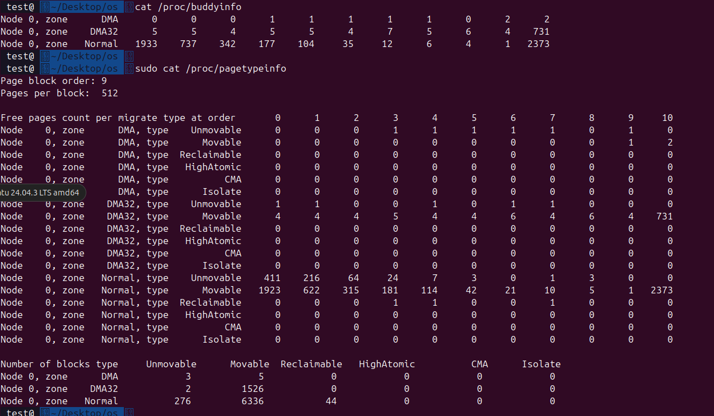

## Test Week 5

### 实验：伙伴系统

简版信息

```
cat /proc/buddyinfo
```

```
yxsu@office:~$ cat /proc/buddyinfo                                                                                                                
Node 0, zone      DMA     16     20     19     13      4      3      2      3      3      2      0                                                       
Node 0, zone    DMA32   1609   1037    507    746    301    298    974    105     83     67     31                                                       
Node 0, zone   Normal     86      8      9      4    108     78     54     48     30      0      0
```

完整信息

```
sudo cat /proc/pagetypeinfo
```

```
yxsu@office:~$ sudo cat /proc/pagetypeinfo                                                                                                                                                                                                                                                
[sudo] password for yxsu:                                                                                                                                
Page block order: 9                                                                                                                                      
Pages per block:  512                                                                                                                                    
                                                                                                                                                         
Free pages count per migrate type at order       0      1      2      3      4      5      6      7      8      9     10                                 
Node    0, zone      DMA, type    Unmovable      9     13     11     10      0      0      0      0      0      0      0                                 
Node    0, zone      DMA, type      Movable      7      7      8      3      4      3      2      3      3      2      0                                 
Node    0, zone      DMA, type  Reclaimable      0      0      0      0      0      0      0      0      0      0      0                                 
Node    0, zone      DMA, type   HighAtomic      0      0      0      0      0      0      0      0      0      0      0                                 
Node    0, zone      DMA, type      Isolate      0      0      0      0      0      0      0      0      0      0      0                                 
Node    0, zone    DMA32, type    Unmovable    229    503    331    234    213    159     58     48     30     21      8                                 
Node    0, zone    DMA32, type      Movable    156    564    469    792    354    165    913     55     51     44     22                                 
Node    0, zone    DMA32, type  Reclaimable      2      0      0      3     11      5      3      2      2      1      1                                 
Node    0, zone    DMA32, type   HighAtomic      0      0      0      0      0      0      0      0      0      1      0                                 
Node    0, zone    DMA32, type      Isolate      0      0      0      0      0      0      0      0      0      0      0                                 
Node    0, zone   Normal, type    Unmovable      1      0      1      1    107     78     54     48     30      0      0                                 
Node    0, zone   Normal, type      Movable     63      0      0      0      0      0      0      0      0      0      0                                 
Node    0, zone   Normal, type  Reclaimable      4      0      0      1      0      0      0      0      0      0      0                                 
Node    0, zone   Normal, type   HighAtomic     18      8      8      2      1      0      0      0      0      0      0                                 
Node    0, zone   Normal, type      Isolate      0      0      0      0      0      0      0      0      0      0      0                                 
                                                                                                                                                         
Number of blocks type     Unmovable      Movable  Reclaimable   HighAtomic      Isolate                                                                  
Node 0, zone      DMA            3            5            0            0            0                                                                   
Node 0, zone    DMA32          124          995           23            1            0                                                                   
Node 0, zone   Normal          286        10640           81            1            0
```

- 尝试理解完整信息，并计算出伙伴系统当前管理的DMA32类型可移动块的总大小，以KB为单位。
- 写出空闲内存大小的计算过程



DMA 给一些老旧设备使用  $2^{24}$ = 16MB  0~16MB
DMA32: 给一些老旧设备使用 $2^{32}$ = 4GB 16MB~4GB
Normal: 普通程序的内存 4GB~内存

- DMA32类型可移动块总大小 = 4 * 4KB + 4 * 8KB + 4 * 16KB + 5 * 32KB + 4 * 64KB + 4 * 128KB + 6 * 256KB + 4 * 512KB + 6 * 1MB + 4 * 2MB + 731 * 4MB = 2942MB + 528KB

这里使用 `cat /proc/buddyinfo`数据进行计算

- 空闲内存大小 = 1938 * 4KB + 742 * 8KB + 346 * 16KB + 183 * 32KB + 110 * 64KB + 40 * 128KB + 20 * 256KB + 12 * 512KB + 10 * 1MB + 7 * 2MB + 3106 * 4MB = 12495MB + 376KB
