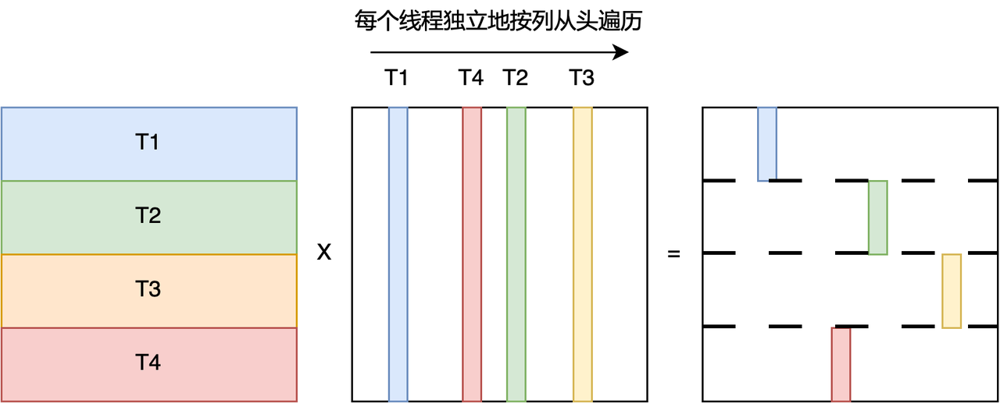
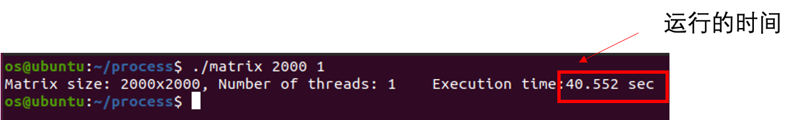
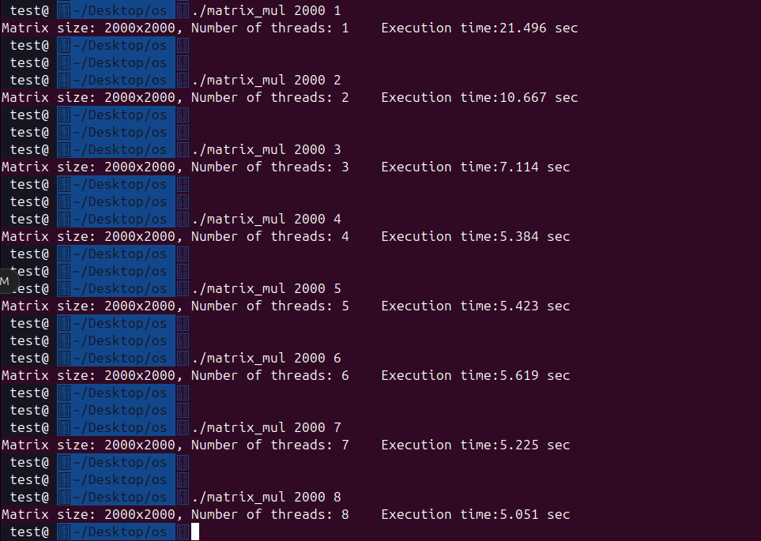
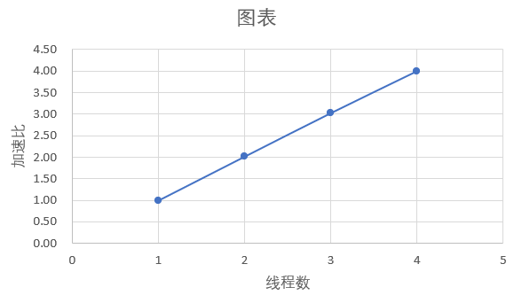
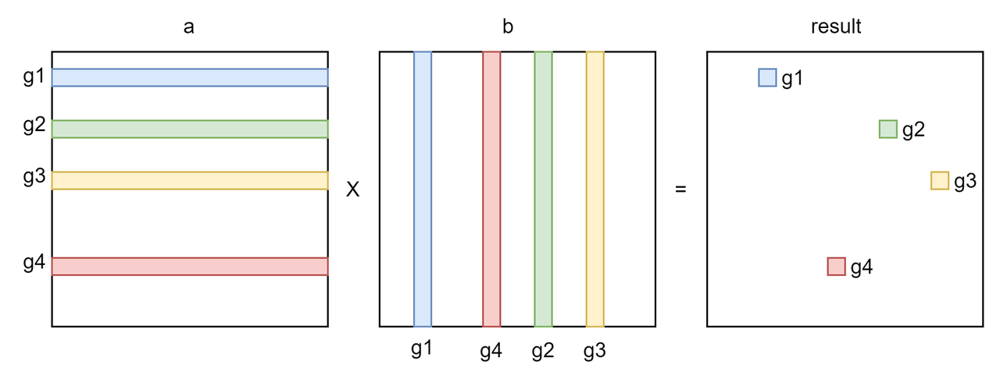
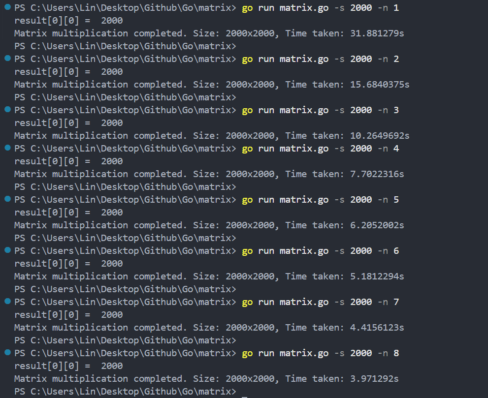
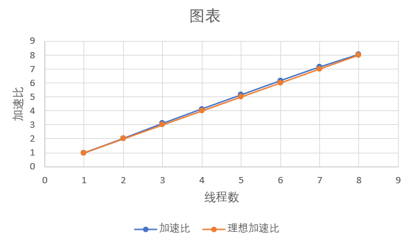
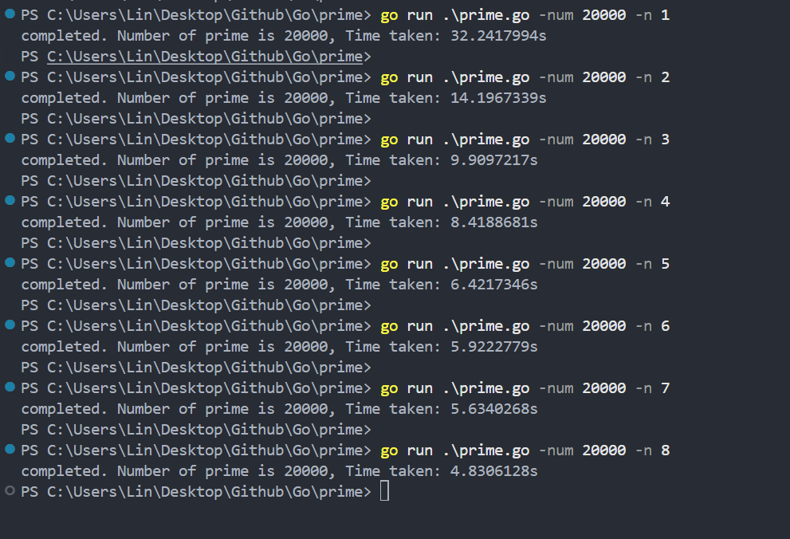

## Test Week 6-8

### 2.2 加速矩阵相乘运算 （作业）




- 在 matrix_mul_pthread.c 中补全worker代码，完成矩阵乘法计算

```
/**
 * Matrix (N*N) multiplication with multiple threads.
 */
#include <stdio.h>
#include <stdlib.h>
#include <sys/time.h>
#include <pthread.h>

int size, num_threads;
double **matrix1, **matrix2, **matrix3;

double **allocate_matrix(int size) {
    /* Allocate 'size' * 'size' doubles contiguously. */
    double *vals = (double *) malloc(size * size * sizeof(double));

    /* Allocate array of double* with size 'size' */
    double **ptrs = (double **) malloc(size * sizeof(double *));

    int i;
    for (i = 0; i < size; ++i) {
        ptrs[i] = &vals[i * size];
    }

    return ptrs;
}

void init_matrix(double **matrix, int size) {
    int i, j;

    for (i = 0; i < size; ++i) {
        for (j = 0; j < size; ++j) {
            matrix[i][j] = 1.0;
        }
    }
}

void print_matrix(double **matrix, int size) {
    int i, j;

    for (i = 0; i < size; ++i) {
        for (j = 0; j < size - 1; ++j) {
            printf("%lf, ", matrix[i][j]);
        }
        printf("%lf", matrix[i][j]);
        putchar('\n');
    }
}

/**
 * Thread routine.
 * Each thread works on a portion of the 'matrix1'.
 * The start and end of the portion depend on the 'arg' which
 * is the ID assigned to threads sequentially.
 */
void *worker(void *arg) {
    int tid = *((int *)arg);

    for(int i = tid; i < size; i += num_threads) {
        for(int j = 0; j < size; j++) {
            double sum = 0;
            for(int k = 0; k < size; k++) {
                sum += matrix1[i][k] * matrix2[k][j];
            }
            matrix3[i][j] = sum;

        }
    }
}

int main(int argc, char *argv[]) {
    int i;
    double sum = 0;
    struct timeval tstart, tend;
    double exectime;
    pthread_t *threads;

    if (argc != 3) {
        fprintf(stderr, "%s <matrix size> <number of threads>\n", argv[0], argv[1]);
        return -1;
    }

    size = atoi(argv[1]);
    num_threads = atoi(argv[2]);

    threads = (pthread_t *) malloc(num_threads * sizeof(pthread_t));

    matrix1 = allocate_matrix(size);
    matrix2 = allocate_matrix(size);
    matrix3 = allocate_matrix(size);

    init_matrix(matrix1, size);
    init_matrix(matrix2, size);

    if (size <= 10) {
        printf("Matrix 1:\n");
        print_matrix(matrix1, size);
        printf("Matrix 2:\n");
        print_matrix(matrix2, size);
    }

    gettimeofday(&tstart, NULL);
    for (i = 0; i < num_threads; ++i) {
        int *tid;
        tid = (int *) malloc(sizeof(int));
        *tid = i;
        pthread_create(&threads[i], NULL, worker, (void *) tid);
    }

    for (i = 0; i < num_threads; ++i) {
        pthread_join(threads[i], NULL);
    }
    gettimeofday(&tend, NULL);

    if (size <= 10) {
        printf("Matrix 3:\n");
        print_matrix(matrix3, size);
    }

    exectime = (tend.tv_sec - tstart.tv_sec) * 1000.0; // sec to ms
    exectime += (tend.tv_usec - tstart.tv_usec) / 1000.0; // us to ms

    printf("Matrix size: %dx%d, Number of threads: %d\tExecution time:%.3lf sec\n",
           size, size, num_threads, exectime / 1000.0);

    return 0;
}
```

- 编译以上代码：

```
gcc matrix_mul_pthread.c -lpthread -o matrix_mul
```

- 运行matrix_mul
  - 注意运行matrix_mul时需要按以下格式传递参数：./matrix_mul `<matrix size>` `<number of threads>`
- 为了验证自己写的代码是否正确，可以先用较小规模的矩阵参与计算：

```
 ./matrix_mul 3 1

Matrix 1:
1.000000, 1.000000, 1.000000
1.000000, 1.000000, 1.000000
1.000000, 1.000000, 1.000000
Matrix 2:
1.000000, 1.000000, 1.000000
1.000000, 1.000000, 1.000000
1.000000, 1.000000, 1.000000
Matrix 3:
3.000000, 3.000000, 3.000000
3.000000, 3.000000, 3.000000
3.000000, 3.000000, 3.000000
Matrix size: 3x3, Number of threads: 1        Execution time:0.000 sec
```

- 现在设成2000x2000的矩阵来验证多线程的加速效果：


例如：

```
 ./matrix_mul 2000 1 
Matrix size: 2000x2000, Number of threads: 1        Execution time:23.853 sec

 ./matrix_mul 2000 2
Matrix size: 2000x2000, Number of threads: 2        Execution time:11.993 sec

 ./matrix_mul 2000 3
Matrix size: 2000x2000, Number of threads: 3        Execution time:7.964 sec

 ./matrix_mul 2000 4
Matrix size: 2000x2000, Number of threads: 4        Execution time:5.987 sec

 ./matrix_mul 2000 5
Matrix size: 2000x2000, Number of threads: 5        Execution time:4.708 sec

 ./matrix_mul 2000 6
Matrix size: 2000x2000, Number of threads: 6        Execution time:4.293 sec

 ./matrix_mul 2000 7
Matrix size: 2000x2000, Number of threads: 7        Execution time:3.966 sec

 ./matrix_mul 2000 8
Matrix size: 2000x2000, Number of threads: 8        Execution time:3.757 sec
```

- 作业要求：
  - 完成矩阵乘法运算，拍照已补全的worker函数部分的代码
  - 按照矩阵大小为2000，线程数分别为1到 8，各运行5次，求各线程数对应的平均运行时间
  - 画出实际计算的加速比曲线，并与理想加速比曲线做比较，拍照上传实际加速比曲线（可以用excel中的画图工具完成）
  - 尝试解释实际加速比和理想加速比存在差异的原因

**虚拟机只分配了4个核心**




### 3.3 协程和管道计算矩阵乘法 （作业）

- 创建size x size个协程，每个协程只负责计算result中一个元素



- 在matrix.go文件中补全函数 multiplyRowByColumn，将ElementResult对象通过管道传递result矩阵中每个元素的结果，完成矩阵乘法

```
package main

import (
    "flag"
    "fmt"
    "runtime"
    "time"
)

type ElementResult struct {
    row   int
    col   int
    value int
}

func multiplyRowByColumn(a [][]int, b [][]int, row, col int, resultChan chan<- ElementResult) {
    res := 0
    for k := 0; k < len(a[0]); k++ {
        res += a[row][k] * b[k][col]
    }
    resultChan <- ElementResult{
        row,
        col,
        res,
    }
}

func concurrentMatrixMultiply(a, b [][]int) [][]int {
    numRows, numCols := len(a), len(b[0])
    result := make([][]int, numRows)
    for i := range result {
       result[i] = make([]int, numCols)
    }

    resultChan := make(chan ElementResult, numRows*numCols)
    for i := 0; i < numRows; i++ {
       for j := 0; j < numCols; j++ {
          go multiplyRowByColumn(a, b, i, j, resultChan)
       }
    }

    for i := 0; i < numRows*numCols; i++ {
       res := <-resultChan
       result[res.row][res.col] = res.value
    }
    close(resultChan)

    return result
}

func generateMatrix(rows, cols int) [][]int {
    matrix := make([][]int, rows)
    for i := range matrix {
       matrix[i] = make([]int, cols)
       for j := range matrix[i] {
          matrix[i][j] = 1
       }
    }
    return matrix
}

func main() {

    var numCores = flag.Int("n", 2, "number of CPU cores to use")
    var size = flag.Int("s", 1000, "size of the matrix")

    flag.Parse()
    runtime.GOMAXPROCS(*numCores)

    a := generateMatrix(*size, *size)
    b := generateMatrix(*size, *size)

    startTime := time.Now()

    result := concurrentMatrixMultiply(a, b)

    duration := time.Since(startTime)

    fmt.Println("result[0][0] = ", result[0][0])

    fmt.Printf("Matrix multiplication completed. Size: %dx%d, Time taken: %v\n", *size, *size, duration)

    // Due to the large size, printing the result matrix is not practical.
    // Consider verifying a few elements if needed or printing the duration only.
}

```

- 运行：

```
go run matrix.go -s 2000 -n 2
```

- matrix.go程序接受 2 个参数：-s <矩阵大小> 以及 -n <线程数>
  - 以上示例表示创建大小为2000x2000的矩阵，并使用 2 个线程进行运算
- 该程序中协程数只和矩阵大小相关
- 此例中设置的线程数为Go语言运行时的线程数
- Go语言运行时会把所有协程分配到不同的线程中运行
- 拍照上传补全的代码部分
- 补全代码后，按照矩阵大小为2000，线程数分别为1、2、3、4、5、6、7、8，各运行5次，求各线程数对应的平均运行时间
- 画出实际计算的加速比，拍照上传，与理想加速比曲线做比较





### 3.4 利用协程和管道筛选质数 (作业)

补全以下代码，计算从 2 开始的前 num 个质数：

```
package main

import (
    "flag"
    "fmt"
    "runtime"
    "time"
)

func Generator(ch chan<- int) {
    for i := 2; ; i++ {
       ch <- i
    }
}

func Filter(in <-chan int, prime int) chan int {
    out := make(chan int)
    go func() {
        for {
            i := <-in
            if i%prime != 0 {
                out <- i
            }
        }
    }()

    return out
    
}

func main() {

    var numCores = flag.Int("n", 2, "number of CPU cores to use")
    var number = flag.Int("num", 1000, "number of prime")

    flag.Parse()
    runtime.GOMAXPROCS(*numCores)

    ch := make(chan int)
    go Generator(ch)

    startTime := time.Now()
    for i := 0; i < *number; i++ {
       prime := <-ch
       if *number < 100 {
           fmt.Println(prime)
       }

       ch = Filter(ch, prime)
    }

    duration := time.Since(startTime)
    fmt.Printf("completed. Number of prime is %d, Time taken: %v\n", *number, duration)
}

```

- 计算前20000个质数，线程数分别为1、2、3、4、5、6、7、8，各运行5次，求各线程数对应的平均运行时间
- 画出实际计算的加速比，并与理想加速比曲线做比较


