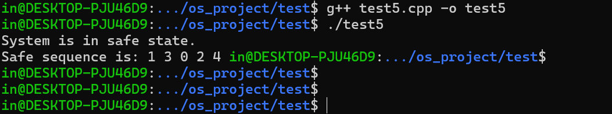

## Test Week 10-11

### 作业 2：只使用互斥锁，实现死锁避免
通过修改哲学家就餐问题的代码逻辑，实现死锁的避免


修改代码逻辑实现死锁避免

```
#include <pthread.h>
#include <stdio.h>
#include <unistd.h>

#define NUM_PHILOSOPHERS 5

pthread_mutex_t forks[NUM_PHILOSOPHERS];

void* philosopher(void* num) {
    int id = *(int*)num;

    int left_fork = id;
    int right_fork = (id + 1) % NUM_PHILOSOPHERS;

    while (1) {
        printf("Philosopher %d is thinking.\n", id);
        usleep(10);  // Sleep for 0.00001 seconds
        if(id == NUM_PHILOSOPHERS - 1) {
            pthread_mutex_lock(&forks[right_fork]);
            printf("Philosopher %d picked up right fork and starts eating.\n", id);
            pthread_mutex_lock(&forks[left_fork]);
            printf("Philosopher %d picked up left fork.\n", id);
        }   else {
            pthread_mutex_lock(&forks[left_fork]);
            printf("Philosopher %d picked up left fork.\n", id);
            pthread_mutex_lock(&forks[right_fork]);
            printf("Philosopher %d picked up right fork and starts eating.\n", id);
        }
        
        usleep(10);  // Sleep for 0.00001 seconds

        pthread_mutex_unlock(&forks[right_fork]);
        printf("Philosopher %d put down right fork.\n", id);
        pthread_mutex_unlock(&forks[left_fork]);
        printf("Philosopher %d put down left fork.\n", id);
    }

    return NULL;
}

int main() {
    pthread_t philosophers[NUM_PHILOSOPHERS];
    int philosopher_numbers[NUM_PHILOSOPHERS];

    for (int i = 0; i < NUM_PHILOSOPHERS; i++) {
        pthread_mutex_init(&forks[i], NULL);
        philosopher_numbers[i] = i;
    }

    for (int i = 0; i < NUM_PHILOSOPHERS; i++) {
        pthread_create(&philosophers[i], NULL, philosopher, &philosopher_numbers[i]);
    }

    for (int i = 0; i < NUM_PHILOSOPHERS; i++) {
        pthread_join(philosophers[i], NULL);
    }

    for (int i = 0; i < NUM_PHILOSOPHERS; i++) {
        pthread_mutex_destroy(&forks[i]);
    }

    return 0;
}

```


### 作业 3：使用条件变量，实现死锁避免
使用pthread_cond_wait()以及pthread_cond_signal()修改以上哲学家就餐问题的代码


```

#include <pthread.h>
#include <stdio.h>
#include <unistd.h>

#define NUM_PHILOSOPHERS 5

#define THINKING 0
#define HUNGRY 1
#define EATING 2

int state[NUM_PHILOSOPHERS];

pthread_mutex_t mutex = PTHREAD_MUTEX_INITIALIZER;
pthread_cond_t cond[NUM_PHILOSOPHERS];


void detect_func(int i){
    if(state[i] == HUNGRY && state[(i + 1) % 5] != EATING && state[(i + 4) % 5] != EATING) {
        state[i] = EATING;
        pthread_cond_signal(&cond[i]);
    }
}


void take_forks(int i) {
    pthread_mutex_lock(&mutex);
    state[i] = HUNGRY;
    detect_func(i);
    while(state[i] != EATING) {
        pthread_cond_wait(&cond[i], &mutex);
    }
    pthread_mutex_unlock(&mutex);
}

void put_forks(int i) {
    pthread_mutex_lock(&mutex);
    state[i] = THINKING;

    detect_func((i + 1) % 5);
    detect_func((i + 4) % 5);

    pthread_mutex_unlock(&mutex);
}


void* philosopher(void* num) {
    int id = *(int*)num;

    while (1) {
        printf("Philosopher %d is thinking.\n", id);
        //usleep(10000);  // Sleep for 0.01 seconds
        take_forks(id);

        put_forks(id);

    }

    return NULL;
}

int main() {
    pthread_t philosophers[NUM_PHILOSOPHERS];
    int philosopher_numbers[NUM_PHILOSOPHERS];

    for (int i = 0; i < NUM_PHILOSOPHERS; i++) {
        pthread_cond_init(&cond[i], NULL);
        state[i] = 0;
        philosopher_numbers[i] = i;
    }

    for (int i = 0; i < NUM_PHILOSOPHERS; i++) {
        pthread_create(&philosophers[i], NULL, philosopher, &philosopher_numbers[i]);
    }

    for (int i = 0; i < NUM_PHILOSOPHERS; i++) {
        pthread_join(philosophers[i], NULL);
    }


    pthread_mutex_destroy(&mutex);
    for (int i = 0; i < NUM_PHILOSOPHERS; i++) {
        pthread_cond_destroy(&cond[i]);
    }

    return 0;
}

```


### 银行家算法


```
// C++ program to illustrate Banker's Algorithm
#include<iostream>
using namespace std;

// Number of processes
const int P = 5;

// Number of resources
const int R = 3;

// Function to find the need of each process
void calculateNeed(int need[P][R], int maxm[P][R],
                   int allot[P][R])
{
    // Calculating Need of each P
    for (int i = 0 ; i < P ; i++)
        for (int j = 0 ; j < R ; j++)

            // Need of instance = maxm instance -
            //                    allocated instance
            need[i][j] = maxm[i][j] - allot[i][j];
}

// Function to find the system is in safe state or not
bool isSafe(int processes[], int avail[], int maxm[][R],
            int allot[][R])
{
    int need[P][R];

    // Function to calculate need matrix
    calculateNeed(need, maxm, allot);

    // Mark all processes as infinish
    bool finish[P] = {0};

    // To store safe sequence
    int safeSeq[P];

    // Make a copy of available resources
    int work[R];
    for (int i = 0; i < R ; i++)
        work[i] = avail[i];

    // While all processes are not finished
    // or system is not in safe state.
    int count = 0;
    while (count < P)
    {
        // Find a process which is not finish and
        // whose needs can be satisfied with current
        // work[] resources.
        bool found = false;
        for (int p = 0; p < P; p++)
        {
            // First check if a process is finished,
            // if no, go for next condition
            if (finish[p] == 0)
            {
                // Check if for all resources of
                // current P need is less
                // than work
                int j;
                for (j = 0; j < R; j++)
                    if (need[p][j] > work[j])
                        break;

                // If all needs of p were satisfied.
                if (j == R)
                {
                    // Add the allocated resources of
                    // current P to the available/work
                    // resources i.e.free the resources
                    for(int k = 0; k < R; k++) {
                        work[k] += allot[p][k];
                    }

                    // Add this process to safe sequence.
                    safeSeq[count] = p;

                    finish[p] = 1;
                    p = -1;
                    count++;
                    found = (count == P);
                    // Mark this p as finished
                    
                }
            }
        }

        // If we could not find a next process in safe
        // sequence.
        if (found == false)
        {
            cout << "System is not in safe state";
            return false;
        }
    }

    // If system is in safe state then
    // safe sequence will be as below
    cout << "System is in safe state.\nSafe"
         " sequence is: ";
    for (int i = 0; i < P ; i++)
        cout << safeSeq[i] << " ";

    return true;
}

// Driver code
int main()
{
    int processes[] = {0, 1, 2, 3, 4};

    // Available instances of resources
    int avail[] = {3, 3, 2};

    // Maximum R that can be allocated
    // to processes
    int maxm[][R] = {{7, 5, 3},
                     {3, 2, 2},
                     {9, 0, 2},
                     {2, 2, 2},
                     {4, 3, 3}};

    // Resources allocated to processes
    int allot[][R] = {{0, 1, 0},
                      {2, 0, 0},
                      {3, 0, 2},
                      {2, 1, 1},
                      {0, 0, 2}};

    // Check system is in safe state or not
    isSafe(processes, avail, maxm, allot);

    return 0;
}

```

