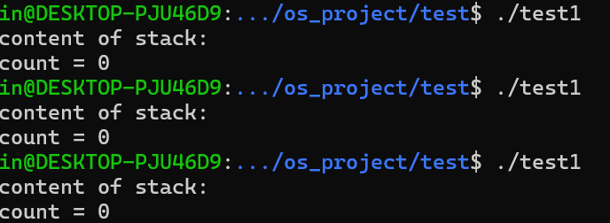
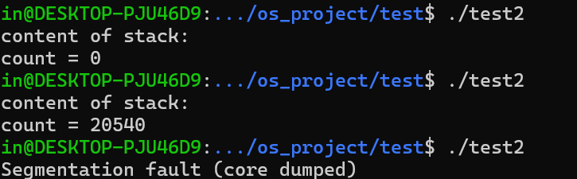

## Test Week 9

### 2.3 线程安全的数据结构

- 何为线程安全？
  - 引入多线程的并发操作之后，原有结构不会遭到破坏
- 以下代码为通过加锁机制实现的线程安全链表：

```
#include <pthread.h>
#include <stdlib.h>
#include <stdio.h>

pthread_mutex_t lock = PTHREAD_MUTEX_INITIALIZER;

typedef struct Node {
    struct Node *next;
    int value;
} Node;

Node *top = NULL; // 栈顶初始化为NULL
int SLIDE = 1000;

void push(Node **top_ptr, Node *n) {
    n->next = *top_ptr;
    *top_ptr = n;
}

void safe_push(Node **top_ptr, Node *n) {
    pthread_mutex_lock(&lock);
    push(top_ptr, n);
    pthread_mutex_unlock(&lock);
}

Node *pop(Node **top_ptr) {
    if (*top_ptr == NULL) {
        return NULL;
    }
    Node *p = *top_ptr;
    *top_ptr = (*top_ptr)->next;
    return p;
}

void* thread_function(void *arg) {

    for(int i = 0; i < SLIDE; i++) {
        Node *new_node = (Node*)malloc(sizeof(Node));
        new_node->value = *(int*)arg * SLIDE + i;

        if (new_node == NULL) {
            perror("Failed to allocate memory for new node");
            pthread_exit(NULL);
        }

        safe_push(&top, new_node); // 可以把这句换成普通的push，感受一下非线程安全的结果
    }
    pthread_exit(NULL);
}

int main() {
    pthread_t threads[10];
    int thread_args[10];


    // 初始化互斥锁
    if (pthread_mutex_init(&lock, NULL) != 0) {
        printf("\n mutex init failed\n");
        return 1;
    }

    // 创建线程
    for (int i = 0; i < 10; i++) {
        thread_args[i] = i;
        if (pthread_create(&threads[i], NULL, thread_function, (void *)&thread_args[i])) {
            perror("Failed to create the thread");
        }
    }

    // 等待线程结束
    for (int i = 0; i < 10; i++) {
        pthread_join(threads[i], NULL);
    }

    // 销毁互斥锁
    pthread_mutex_destroy(&lock);

    // print
    Node *current = top;
    int count = 0;
    printf("content of stack:\n");
    while (current != NULL) {
        count++;
        //printf("%d\n", current->value);
        current = current->next; // 假设每个节点都有一个指向下一个节点的指针
    }
    printf("count = %d\n", count);

    return 0;
}

```

- 作业要求：改造以上代码，不使用锁，只使用原子操作，写出线程安全的链表(包括append, pop)
  - 提交时上传append pop两个函数的代码

```
#include <pthread.h>
#include <stdlib.h>
#include <stdio.h>

pthread_mutex_t lock = PTHREAD_MUTEX_INITIALIZER;

typedef struct Node {
    struct Node *next;
    int value;
} Node;

Node *top = NULL; // 栈顶初始化为NULL
int SLIDE = 10000;

void safe_push(Node **top_ptr, Node *n) {
    n->next = *top_ptr;
    while(!__sync_bool_compare_and_swap(top_ptr, n->next, n)) {
        n->next = *top_ptr;
    }
}

void push(Node **top_ptr, Node *n) {
    n->next = *top_ptr;
    *top_ptr = n;
}

Node *safe_pop(Node **top_ptr) {
    Node *p = *top_ptr;
    while(p!= NULL && !__sync_bool_compare_and_swap(top_ptr, p, p->next)) {
        p = *top_ptr;
    }
    return p;
}

Node *pop(Node **top_ptr) {
    if (*top_ptr == NULL) {
        return NULL;
    }
    Node *p = *top_ptr;
    *top_ptr = (*top_ptr)->next;
    return p;
}

void* thread_function(void *arg) {

    for(int i = 0; i < SLIDE; i++) {
        Node *new_node = (Node*)malloc(sizeof(Node));
        new_node->value = *(int*)arg * SLIDE + i;

        if (new_node == NULL) {
            perror("Failed to allocate memory for new node");
            pthread_exit(NULL);
        }

        safe_push(&top, new_node); // 可以把这句换成普通的push，感受一下非线程安全的结果
    }

    for(int i = 0; i < SLIDE; i++) {
        Node *p = safe_pop(&top);
    }

    pthread_exit(NULL);
}

int main() {
    pthread_t threads[10];
    int thread_args[10];


    // 初始化互斥锁
    if (pthread_mutex_init(&lock, NULL) != 0) {
        printf("\n mutex init failed\n");
        return 1;
    }

    // 创建线程
    for (int i = 0; i < 10; i++) {
        thread_args[i] = i;
        if (pthread_create(&threads[i], NULL, thread_function, (void *)&thread_args[i])) {
            perror("Failed to create the thread");
        }
    }

    // 等待线程结束
    for (int i = 0; i < 10; i++) {
        pthread_join(threads[i], NULL);
    }

    // 销毁互斥锁
    pthread_mutex_destroy(&lock);

    // print
    Node *current = top;
    int count = 0;
    printf("content of stack:\n");
    while (current != NULL) {
        count++;
        //printf("%d\n", current->value);
        current = current->next; // 假设每个节点都有一个指向下一个节点的指针
    }
    printf("count = %d\n", count);

    return 0;
}

```

- 修改SLIDE为10000 增加多线程不安全pop push触发错误的概率
  test1为safe_push safe_pop
  test2是push pop

test1 安全


test2 会出现错误

